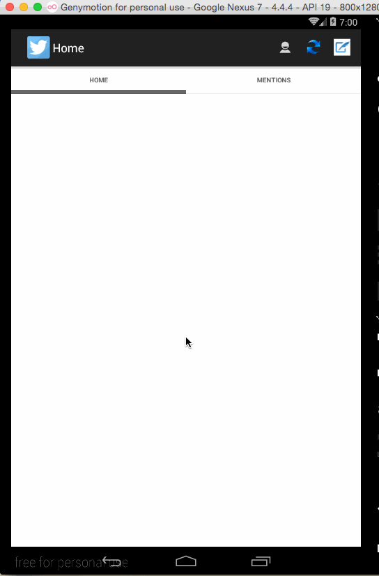

# HW4TwitterFragments

**HW4TwitterFragments** is an android app that allows a user to view home and mentions timelines, view user profiles with user timelines, as well as compose and post a new tweet. The app utilizes [Twitter REST API](https://dev.twitter.com/rest/public).

Time spent: **8** hours spent in total

## User Stories

The following **required** functionality is completed:

* [x] The app includes **all required user stories** from Week 3 Twitter Client
* [x] User can **switch between Timeline and Mention views using tabs**
  * [x] User can view their home timeline tweets.
  * [x] User can view the recent mentions of their username.
* [x] User can navigate to **view their own profile**
  * [x] User can see picture, tagline, # of followers, # of following, and tweets on their profile.
* [x] User can [infinitely paginate](http://guides.codepath.com/android/Endless-Scrolling-with-AdapterViews) any of these timelines (home, mentions, user) by scrolling to the bottom

## Video Walkthrough 

Here's a walkthrough of implemented user stories:

GIF created with [LiceCap](http://www.cockos.com/licecap/).

## Notes

Describe any challenges encountered while building the app.

## Open-source libraries used

- [Android Async HTTP](https://github.com/loopj/android-async-http) - Simple asynchronous HTTP requests with JSON parsing
- [Picasso](http://square.github.io/picasso/) - Image loading and caching library for Android

## License

    Copyright [Groupon] [name of copyright owner]

    Licensed under the Apache License, Version 2.0 (the "License");
    you may not use this file except in compliance with the License.
    You may obtain a copy of the License at

        http://www.apache.org/licenses/LICENSE-2.0

    Unless required by applicable law or agreed to in writing, software
    distributed under the License is distributed on an "AS IS" BASIS,
    WITHOUT WARRANTIES OR CONDITIONS OF ANY KIND, either express or implied.
    See the License for the specific language governing permissions and
    limitations under the License.

